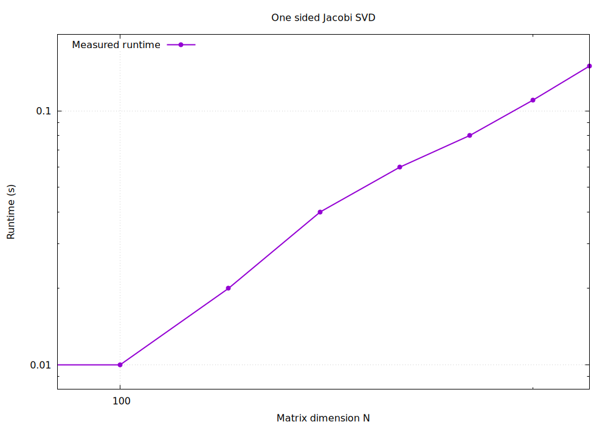

# Examination project by Marius Abildgaard Brødbæk

Author: Marius Abildgaard Brødbæk
Studienummer: 202308011
Examination project: One-sided Jacobi algorithm for Singular Value Decomposition (index number 19)
Link: 

Link to my github repo: https://github.com/Mariusabild/PPNM

# Task description 
from https://fedorov.sdfeu.org/prog/projex/svd-one-sided.htm

# Introduction
The singular value decomposition (SVD) of a (real square, for simplicity) matrix A is a representation of the matrix in the form
A = U D VT ,

where matrix D is diagonal with non-negative elements and matrices U and V are orghogonal. The diagonal elements of matrix D can always be chosen non-negative by multiplying the relevant columns of matrix U with (-1).
SVD can be used to solve a number of problems in linear algebra.

Problem
Implement the one-sided Jacobi SVD algorithm.

Algorithm
In this method the elementary iteration is given as
A → A J(θ,p,q)

where the indices (p,q) are swept cyclicly (p=1..n, q=p+1..n) and where the angle θ is chosen such that the columns number p and q of the matrix AJ(θ,p,q) are orthogonal. One can show that the angle should be taken from the following equation (you should use atan2 function),
tan(2θ)=2apTaq /(aqTaq - apTap)

where ai is the i-th column of matrix A (check this).
After the iterations converge and the matrix A'=AJ (where J is the accumulation of the individual rotations) has orthogonal columns, the SVD is simply given as

A=UDVT

where
V=J, Dii=||a'i||, ui=a'i/||a'i||,

where a'i is the i-th column of matrix A' and ui us the i-th column of matrix U.

# Proof/check of formula for theta

From  equation (13) in the book https://fedorov.sdfeu.org/prog/book/eigen.pdf 

a_p' = c*a_p - s*a_q and  
a_q' = s*a_p + c*a_q

Which are the collums after a Jacobi rotation.

We require these to be orthogornal after a rotation:

(a_p')^T*a_q' = 0

We insert our expressions which yields:

(c*a_p - s*a_q)^T*(s*a_p + c*a_q) = 0

Now we can expand and rearrange:

(c^2 -s^2)*a_p^T*a_q+c*s*(a_p^T*a_p - a_q^T*a_q) = 0

Now we can use the trigonometric identities:

c^2-s^2=cos(2*theta) and
2*c*s= sin(2*theta)

This yields:

cos(2*theta)*a_p^T*a_q+1/2*sin(2*theta)(a_p^T*a_p - a_q^T*a_q) = 0

Divide by cos(2*theta) to obtain:

a_p^T*a_q+1/2*sin(2*theta)/cos(2*theta)*(a_p^T*a_p - a_q^T*a_q) = 0

Use the definition of tan(theta) = sin(theta)/cos(theta), and isolate tan(2*theta):

a_p^Ta_q+1/2*tan(2*theta)*(a_p^T*a_p - a_q^Ta_q) = 0

Rearrange:

tan(2*theta) = -2*(a_p^T*a_q)/(a_p^T*a_p - a_q^T*a_q)

Multiply by -1:

tan(2*theta) = 2*(a_p^T*a_q)/(a_q^T*a_q - a_p^T*a_p)

This is the desired formula to be shown.

# Implementation of code

- run "make" to compile the project.
- run "make clean" to remove the object files and output.

I have implemented the theory in the task description and the book in "svd.h". This file both initialize and declerare the algortihm in my namespace pp (practical programming). Furthermore i have a matrix and vector class I made earlier, in "matrix.h". I use this matrix class to implement the algorithm.

First i have a timeJ function multiplying the Jacobi rotation matrix from the right. Then I make a function jacobi_svd which calculates apq app aqq, which is abbreviations of the terms in the formula for calculating the angle of rotation. After convergence, the singular values are computed using the norms of the orthogonalized columns and the columns of U are obtained as the normalized columns.

# Verification and tests

I have also made "main.cc", which performs tests of the algorithm to determine if it is implemented correct. In this, a generate a random 5x5 matrix A. Then i perform one sided SVD on it. These tests consists of the following:

- Reconstruct A as A = U*D*V^T. Then I subtract teh original matrix A, and obtain matrix elements on the order of 10^(-16), meaning they are practically identical.
- Check whether D is a diagonal matrix with no negative elements (It is found to be diagonal, and contain no negative elements).
- Calculate U^T*U and V^T*V, which should yield the identity matrix since they are orthogonal (They do indeed the identity matrix upto machine epsilon).

# Computational complexity

To further investigate the computational complexity of one sided jacobi SVD algorithm, I made a log-log plot of using the algorithm on varying matrix sizes which can be seen in "timing.png". This is to test whether the algorithm scales as O(n^3). Each Jacobi sweep takes O(n^2) rotations, while each requires O(n) operations, yielding O(n^2)*O(n)=O(n^3). The plot shwos a linear tendency in the log-log plot, matching the expected tendency tendency.

# Applications
I have also implemented some applications of SVD inspired by Wikipedia.

## Solving a homogenous linear equation
I constructed a 3x3 matrix B with rank 1, and performed SVD on it. The SVD correctly identified vanishing singular values. The vector x corresponding to a singlar value was extracted and afterwards inserted into a equation yeilding Bx = 0. This shows how SVD can be used to identify vectors belonging to the nullspace of a matrix.

## Pseudo inverse
I calculated the matrix D^+ as the reciprocal values of the nonzero singular values. Subsequently i calculated the pseudo inverse as A^+ = V*D^+*U^T. Afterwards i tested whether A*A^+*A = A, by calculating A*A^+*A - A, which yielded zero upto nummerical preceision in all matrix elements.

# AI-declaration
The code parts generated by AI can be seen marked in the code as comments. This readme file is firstly written by myself, and afterwards discussed and improved using ChatGPT.  